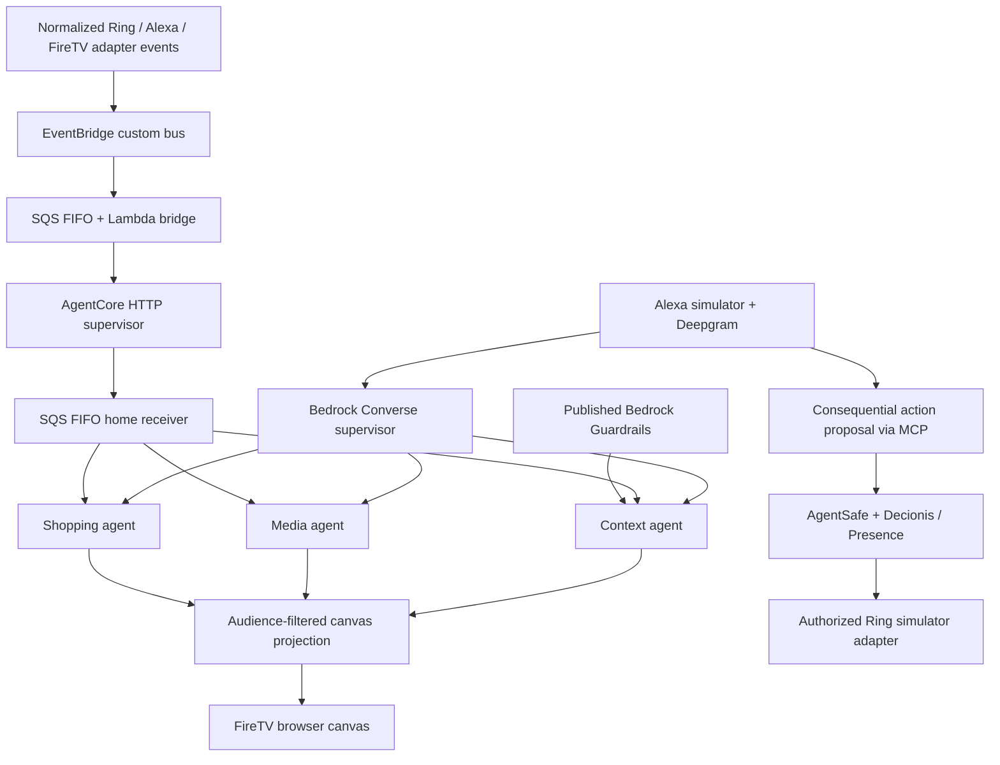

# HomeBound architecture and delivery phases

## Locked pitch

> Alexa can unlock your front door or disable your Ring camera—but should it? We’re building a zero-trust control layer for AI-powered homes with Decionis, ensuring AI agents act only on authorized actions.

## Four separate layers

```text
Alexa-style web simulator + Deepgram voice (or CLI)
    captures typed or spoken requests and presents execution evidence
              ↓
Bedrock / Alexa+ orchestration
    understands the request and selects a tool
              ↓
HomeBound MCP + AgentSafe interception
    captures an exact proposal and prevents direct device access
              ↓
Decionis Execution Authority + managed Presence
    evaluates policy and returns ALLOW, ESCALATE, or BLOCK
              ↓
Ring execution adapter
    performs the authorized action and records device state
```

Bedrock is the live orchestration integration in the prototype. Alexa+ MCP add-on onboarding is a separate partner-gated deployment step. The MCP service is a real Streamable HTTP server; its handlers never call a Ring SDK. The official Decionis AgentSafe runtime runs as a separate trusted process because its supported executor is Node.js. The HomeBound application, MCP server, scenarios, and simulator remain Python.

While Alexa+ partner access is unavailable, the [web simulator](web-simulator.md) supplies a full-screen Alexa-style voice experience. Deepgram handles speech recognition and synthesis on the server. A Bedrock dialogue interpreter extracts untrusted conversation facts without access to MCP; a server-side dialogue state gathers missing details, captures simulation context, and binds one exact action before the Bedrock execution loop calls MCP. No authenticated role is inferred from speech. The browser never receives execution credentials or a direct Ring route. Spoken action confirmations are derived from structured MCP results. Parent approval remains in Decionis Presence, and the UI can only recheck a saved handoff belonging to its current conversation. The listener retains one microphone connection, discards quiet buffers locally, and suspends capture during playback.

The [escalation interface](escalation.md) presents the saved request, returned approval status, and the earlier of the approval and intent expiries. Quiet browser checks keep the microphone connected and recording; a terminal result is spoken once. Voice claims of parental approval only select a session-owned handoff to recheck. The MCP client serializes resumes and retains handoffs through temporary authority failures. Unknown execution stops automatic checks instead of inviting a retry. The live Decionis tenant currently lacks its managed Presence connection, so a real parent ceremony remains unvalidated.

## Ambient canvas and cognitive orchestration

The [FireTV canvas](firetv-canvas.md) shares the Alexa simulator's home state through a separate `/tv` surface. Bedrock extracts one typed proposal from the latest request and public media context. Three bounded specialists handle note eligibility, media layout, and scene/pantry joins. They return data for fixed UI components; they cannot supply scripts, URLs, payment instructions, identity grants, or physical execution.



This diagram includes the deployment path. Locally, simulated events go directly to the same specialist/receiver logic, and Converse runs from the web server. Setting the optional runtime ARN routes conversation planning through AgentCore; setting the output queue URL starts its SQS receiver. The cloud path carries normalized ambient events, never private note bodies. Typed event routing does not wait for an LLM, so model inference cannot stall local playback or guest redaction. Both transports recalculate current audience policy at the home receiver instead of trusting a delayed UI hint.

Spatial memory currently means private, durable SQLite notes with explicit recipients and expiry. It is not AgentCore Memory or inferred identity. A future authenticated, consented sensor adapter must establish a home/subject binding before replacing the simulated audience. Guardrails screens content; it does not authenticate occupants. The local runtime uses conservative demo screening unless a published Guardrails policy is configured.

Room orchestration currently previews five fixed capabilities and can restore the prior preview. To operate a physical TV or light, implement each capability behind the existing AgentSafe/Decionis execution boundary, with exact targets, returned execution evidence, failure handling, and state reconciliation. A dashboard event, model interpretation, or cart proposal cannot substitute for that authority. No new physical or payment capability is exposed by this phase.

## PR phases

1. **Orchestration and MCP contract** — Python package, Streamable HTTP MCP endpoint, Bedrock Converse tool-use loop, schemas, and fail-closed tool responses. No device can execute in this phase.
2. **AgentSafe and Decionis authority** — connect Python MCP tools to the official `@decionis/agentsafe` executor; configure real Decionis credentials, exact action bindings, managed Presence escalation, grant consumption, and durable escalation resume state. Physical dispatch remains disabled until Phase 3.
3. **Ring simulator and complete scenarios** — wire the authorized executor to a stateful Ring simulator; configure the household policy; run the three prescribed scenarios; retrieve the exact signed Decision Dossier from Decionis and verify it with the official verifier; add binding, replay, expiry, and audit integration coverage and final demo documentation.
4. **Runtime and Bedrock compatibility** — preserve Python 3.10 support, declare direct MCP/credential-provider dependencies, adapt Nova's restricted tool schema without changing the MCP contract, restore the audit package to version control, and make local AWS profile setup reproducible.

Each phase is delivered as its own pull request. Later PRs stack on the previous phase until merged.

## Phase 1 request path

1. The Bedrock Converse API receives natural language and the MCP tool schemas.
2. Bedrock selects `unlockDoor`, `disarmSystem`, or `viewStream`.
3. The Python orchestration client invokes that tool over Streamable HTTP MCP.
4. The tool creates a typed action proposal and sends it to the interception port.
5. Until AgentSafe is configured, the port returns `BLOCK / NOT_PERFORMED`.

Bedrock does not receive Ring credentials, policy rules, or a device SDK. A model tool call is a proposal only.

## Integration sources and constraints

- MCP uses the [official Python SDK](https://github.com/modelcontextprotocol/python-sdk)'s Streamable HTTP transport.
- Bedrock uses the AWS SDK for Python (`boto3`) and the [Converse](https://docs.aws.amazon.com/bedrock/latest/APIReference/API_runtime_Converse.html) tool-use contract.
- The official Decionis [AgentSafe runtime](https://www.npmjs.com/package/@decionis/agentsafe) is distributed for Node.js. HomeBound will keep it as an isolated process instead of reimplementing its execution authority in Python.
- Decionis natively manages Presence as part of its authority flow. Following Commerce, HomeBound asks Decionis to manage Presence and resumes the exact AgentSafe handoff; HomeBound does not call Presence directly. The current official AgentSafe executor requires a household approver identity in trusted managed-mode configuration; this identity never comes from the agent proposal.
- Ring hardware is not required. Physical execution uses a clearly labelled Python simulator adapter.

The courier and child context in the demo is a deterministic fixture delivered through MCP. A production household must authenticate context signals at their source and configure tenant policy to account for their provenance; an agent-provided claim is not independent identity proof.

The reviewed [Alexa+ add-on documentation](https://developer.amazon.com/docs/alexaplus/add-ons/home.html) describes a selected-partner access program. A live Alexa+ claim requires onboarding through Amazon; the Bedrock route is the active orchestration integration in this prototype.
